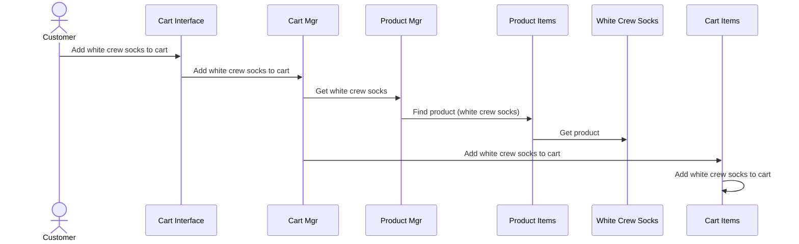
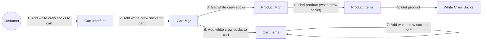

### Sequence Diagram

```mermaid
sequenceDiagram
    actor Customer
    participant CI as Cart Interface
    participant CM as Cart Mgr
    participant PM as Product Mgr
    participant PI as Product Items
    participant WCS as White Crew Socks
    participant CIT as Cart Items

    Customer->>CI: Add white crew socks to cart
    CI->>CM: Add white crew socks to cart
    CM->>PM: Get white crew socks
    PM->>PI: Find product (white crew socks)
    PI->>WCS: Get product
    CM->>CIT: Add white crew socks to cart
    CIT->>CIT: Add white crew socks to cart
```

### Collaboration Diagram

```mermaid
flowchart LR
    Customer((Customer))
    CI[Cart Interface]
    CM[Cart Mgr]
    PM[Product Mgr]
    PI[Product Items]
    WCS[White Crew Socks]
    CIT[Cart Items]

    Customer -->|"1: Add white crew socks to cart"| CI
    CI -->|"2: Add white crew socks to cart"| CM
    CM -->|"3: Get white crew socks"| PM
    PM -->|"4: Find product (white crew socks)"| PI
    PI -->|"5: Get product"| WCS
    CM -->|"6: Add white crew socks to cart"| CIT
    CIT -->|"7: Add white crew socks to cart"| CIT
```
