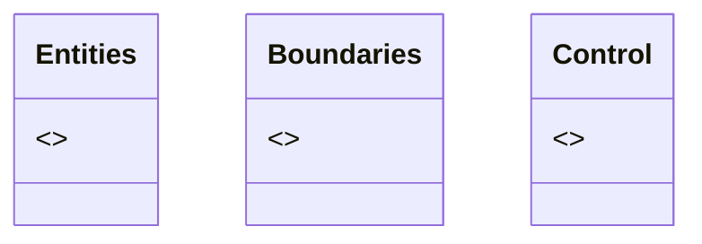
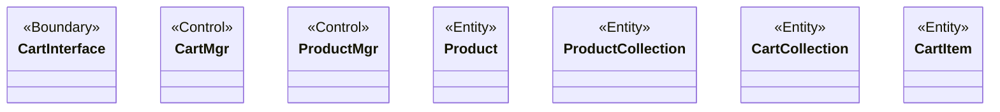
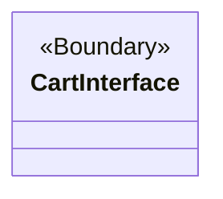
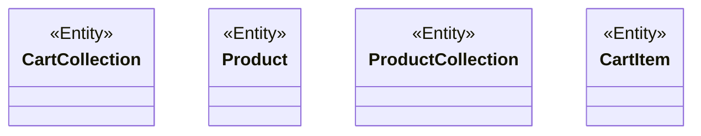
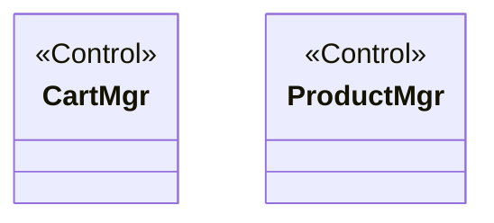

### Main Class Diagram (Packages)

### Add Item to Shopping Cart — All Classes with Stereotypes

### Boundaries Package — Main Class Diagram

### Entities Package — Main Class Diagram

###  Control Package — Main Class Diagram

### What Was Done
Built five class diagrams modeling the static structure of the shopping cart system: a Main Class diagram showing the three packages (Entities, Boundaries, Control), a class diagram containing all seven classes used in the "Add Item to Shopping Cart" use case (CartInterface, CartMgr, ProductMgr, Product, ProductCollection, CartCollection, CartItem) with their stereotypes assigned, and three per-package Main Class diagrams showing the classes grouped into Boundaries, Entities, and Control packages.

### Mermaid.js Steps
Used Mermaid's native classDiagram syntax, which directly supports class diagrams without workarounds. Each class was declared with the class ClassName syntax, and stereotypes were applied using the <<Stereotype>> notation (e.g. <<Boundary>>, <<Control>>, <<Entity>>), which Mermaid renders as guillemets (« ») in line with standard UML conventions.

### Native Support, No Workaround Needed
Unlike the previous tasks (sequence, collaboration and use case diagrams), Mermaid provides first-class support for class diagrams, including stereotypes, attributes, operations and relationships. No flowchart fallback was required and the rendered output closely matches standard UML notation.
